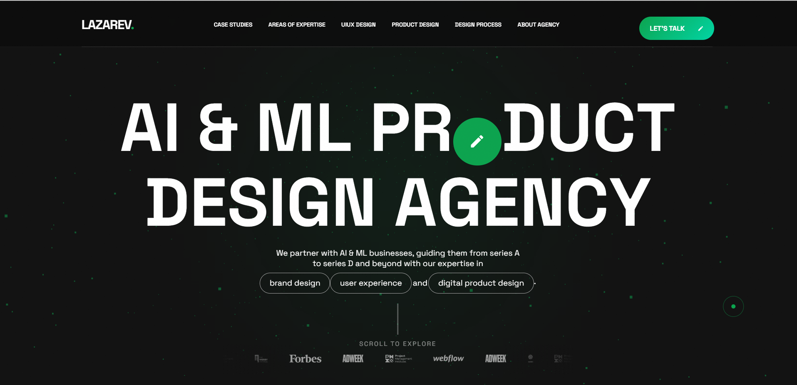

# Lazarev Digital Agency Website Clone 💻✨

A modern, pixel-perfect, and fully responsive clone of the Lazarev Digital Agency website — built using **HTML**, **CSS**, and **JavaScript**.

## 🔍 About the Project

This project is a frontend clone of the visually rich and interactive Lazarev Agency site. It showcases elegant animations, responsive layouts, and an eye-catching user experience — all coded from scratch without any frameworks.

> ✅ Perfect for practicing layout structuring, CSS animations, and responsive design principles.

## 🚀 Live Demo

👉 [Click here to view the live site](https://lazarev-website-clone-six.vercel.app/)  
👉 [GitHub Repository](https://github.com/Gautamjha321/LAZAREV-WEBSITE-CLONE/tree/main)

## 🛠️ Technologies Used

- HTML5  
- CSS3 (Flexbox, Grid, Animations)  
- JavaScript (Vanilla JS for interactions)  

## 📱 Responsive Design

The website is 100% responsive and adapts smoothly to all screen sizes:
- ✔️ Desktop  
- ✔️ Tablet  
- ✔️ Mobile  

## 🔥 Key Features

- Smooth scroll and transitions  
- Sticky navigation  
- Hover effects and micro-interactions  
- Fully responsive grid layout  
- Custom animated cursor  
- Scroll-triggered animations  

## 📁 Folder Structure
lazarev-agency-clone/
│
├── index.html
├── style.css
├── script.js
├── assets/
│ ├── images/
│ └── icons/

## 📷 Screenshots

  

## 🙌 Author

👤 **Gautam Kumar Jha**  
🔗 [LinkedIn](https://www.linkedin.com/in/gautam-jha-77111634b/)  
🐙 [GitHub](https://github.com/Gautamjha321)

---

## 📝 License

This project is open source and available under the [MIT License](LICENSE).

---

If you liked this project, don’t forget to ⭐ the repo and share your feedback!

